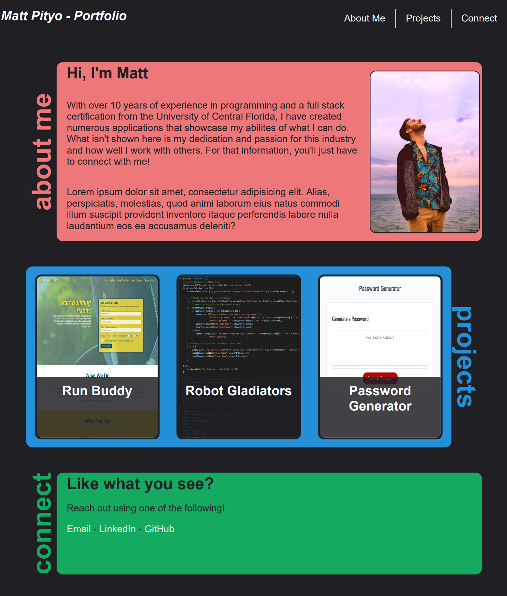

# Matt Pityo's Portfolio
Stay up to date with my recently completed projects. Version 1 of the website features easy to read content in addition to a responsive design and a gentle GUI. Hover over the projects to either view or go to the code base, and connect with me by using the links at the bottom. 
 

## Features
 - Interactive projects section that responds to a user's hover
 - A clean and minimalistic display that showcases content using smartly designed margins
 - Color coded sections that pop, as well as divide for easier readability
 - Page is designed to respond to a users screen size using flexbox and media screens
 - Scalable font sizes
 - A header that is always reachable and viewable, while keeping content viewable underneath

## 🔑 How to access
The code base can be cloned from the GitHub repo [here](https://github.com/mpityo/portfolio). 
The website may be viewed on GitPages [here](https://mpityo.github.io/portfolio/) 
 

